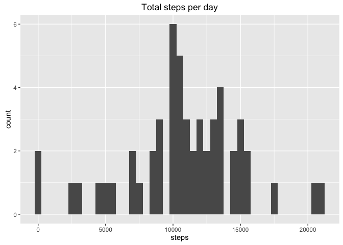

# Reproducible Research: Peer Assessment 1
The code in this analysis was developed and tested in R version 3.2.2 using RStudio version 0.99.489 running on Mac OS X 10.10.5

Load libraries to be used.

```r
library(knitr)
```

```
## Warning: package 'knitr' was built under R version 3.2.3
```

```r
library(dplyr)
```

```
## 
## Attaching package: 'dplyr'
```

```
## The following objects are masked from 'package:stats':
## 
##     filter, lag
```

```
## The following objects are masked from 'package:base':
## 
##     intersect, setdiff, setequal, union
```

```r
library(ggplot2)
```

```
## Warning: package 'ggplot2' was built under R version 3.2.4
```

## Loading and preprocessing the data
The code assumes that the source data file activity.zip has been downloaded and unzipped to save the data file activity.csv in the R working directory.
Read the activity data in to a data frame table and convert the date variable from class character to class date

```r
activity <- tbl_df(read.csv("activity.csv", stringsAsFactors = FALSE))
activity$date <- as.POSIXct(activity$date)
```

## What is mean total number of steps taken per day?
Calculate the total number of steps taken per day, ignoring missing values and make a histogram of the daily totals.

```r
daySteps <- na.omit(summarise(group_by(activity, date), dayTotal = sum(steps)))
qplot(daySteps$dayTotal, 
      geom = "histogram", 
      binwidth = 500,
      xlab = "steps", 
      main = "Total steps per day"
      )
```



```r
# calculate mean and median
meanDaySteps <- mean(daySteps$dayTotal)
medianDaySteps <- median(daySteps$dayTotal)
```
The mean total steps per day is 10766 and the median total steps per day is 10765.

## What is the average daily activity pattern?

```r
dayPattern <- summarise(group_by(activity, interval), intAverage = mean(steps, na.rm = TRUE))
qplot(interval, intAverage, data = dayPattern, 
      geom = "line",
      ylab = "steps",
      main = "Daily pattern - average steps")
```


```r
maxStepsInt <- dayPattern$interval[which.max(dayPattern$intAverage)]
```
The daily time interval with the highest average number of steps is 835.

## Imputing missing values

```r
sumNAs <- sum(is.na(activity$steps))
```
The total number of missing values (NAs) in the dataset for steps in a five-minute interval is 2304.

To impute these missing values, we will replace each missing value with the mean value for that time interval across the dataset. This is the value for that interval from the data frame table dayPattern calculated above. The function to replace the missing values with the mean is thanks to [this StackOverflow answer][1].

```r
impute.mean <- function(x) replace(x, is.na(x), mean(x, na.rm = TRUE))
imputeActivity <- mutate(group_by(activity, interval), 
                         steps = impute.mean(steps))
imputeDaySteps <- na.omit(summarise(group_by(imputeActivity, date),
                                    dayTotal = sum(steps)))
qplot(imputeDaySteps$dayTotal, 
      geom = "histogram", 
      binwidth = 500,
      xlab = "steps", 
      main = "Total steps per day"
)
```


```r
meanDayStepsImp <- mean(imputeDaySteps$dayTotal)
medianDayStepsImp <- median(imputeDaySteps$dayTotal)
```
The mean total steps per day with imputed data is 10766. This is the same as the mean for the data with missing values.
The median total steps per day with imputed data is 10766. This has shifted to the mean, compared to the data with missing values.
The histogram above shows that the impact of this method of imputing the missing values has been to increase the count of the mean value. There is no other impact on the distribution.

## Are there differences in activity patterns between weekdays and weekends?
In the dataset with imputed values, find the weekdays from the date variable, allocate the days to weekdays or weekend as a factor variable. Plot the activity pattern (mean total steps per time interval) separately for weekdays and weekends. 

```r
weekendList <- c("Saturday", "Sunday")
imputeActivity <- imputeActivity %>%
     mutate(dayName = weekdays(as.POSIXct(date))) %>%
     mutate(dayFactor = ifelse(dayName %in% weekendList, "weekend", "weekday")) %>%
     mutate(dayFactor = factor(dayFactor))

compareWkendWkDay <- summarise(group_by(imputeActivity, interval, dayFactor), 
                               intAverage = mean(steps))

wkplot <- ggplot(data = compareWkendWkDay,
                 aes(x = interval, y = intAverage)) +
                 geom_line() +
                 facet_grid(dayFactor ~ .) +
                 ggtitle("Mean steps weekdays and weekends") +
                 labs(y = "steps")

print(wkplot)     
```


The plots show that on weekdays, activity starts earlier and peaks around 9am, presumably reflecting the daily commute for a largely sedentary worker. Weekend activity starts later but is generally higher in terms of numbers of steps until the mid evening. 

[1]: http://stackoverflow.com/questions/9322773/how-to-replace-na-with-mean-by-subset-in-r-impute-with-plyr
